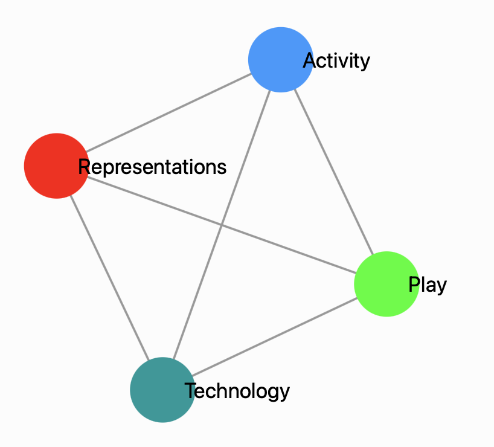

## About RAPT Lab

We are broadly interested in how people learn in complex, real-world circumstances. However, as our acronym indicates we have a number of areas we focus on depending on the project:

<ul><strong>Representations:</strong> Representations are anything that stands for something else. A name, word, picture or diagram can each refer to the same object or idea, transforming how we understand that object or idea. We are interested in all kinds of representations including drawings, pictures, graphs, plays, skits, and computer simulations.</ul>
<ul><strong>Activity:</strong> We build on sociocultural theories of learning, which highlight the fact that people are always acting in a social world, often in pursuit of one or more goals.</ul>
<ul><strong>Play:</strong> Play is both a powerful motivator and a key element of human learning and development. We are interested in exploring what kinds of play, and how it can be organized to support learning.</ul>
<ul><strong>Technology:</strong> We design new technologies that help bring people together to learn in new ways</ul>

Most of our projects combine these ideas together! 
<!-- 
 

-->

## Recent publications

  <ul class="pubs">




<li>{{publication.citation}}        

    
      [<a href="{{link.url}}" target="_blank">{{link.linklabel}}</a>]
      
    

      
      
        [<a href="{{project_info.more}}">{{project_info.name}} project info</a>]
        [<a href="{{project_info.url}}" target="_blank">{{project_info.name}} website</a>]
      

    </li>
  

  </ul>
